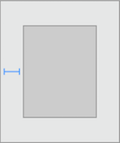
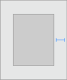
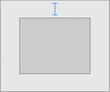
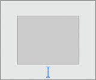
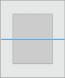
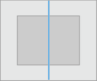
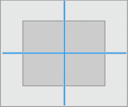

# KVConstraintKit
KVConstraintKit is a DSL to make easy & impressive Auto Layout constraints on iOS with Swift

## Custom Operators
The following types of `operators` are provided by `KVConstraintKit`, to `add`, `remove`, `access` and `modify` constraints.

| Operator | Meaning |
| :--------: |-------|
| + | to `add` constraint |
| - | to `remove` constraint |
| * | to modify `multiplier` of constraint |
| ~ | to modify `Priority` ( **UILayoutPriority** ), `Relation` ( **NSLayoutRelation** ) & `Replace` constraint|
| <- | to access constraint by attributes ( **eg. NSLayoutAttribute.Height** ) |
| +== | to add equal relation ( **NSLayoutRelation.Equal** ) constraint |
| +>= | to add greater than or equal relation ( **NSLayoutRelation.GreaterThanOrEqual** ) constraint |
| +<= | to add less than or equal relation ( **NSLayoutRelation.LessThanOrEqual** ) constraint |
| +*== | to add equal relation ( **NSLayoutRelation.Equal** ) constraint with `multiplier` |
| +*>= | to add greater than or equal relation ( **NSLayoutRelation.GreaterThanOrEqual** ) constraint with `multiplier` |
| +*<= | to add less than or equal relation ( **NSLayoutRelation.LessThanOrEqual** ) constraint with `multiplier` |


## Usage

Here's a quick example:
##### Without Using KVConstraintKit
```swift
let v = UIView.prepareNewViewForAutoLayout()
v.backgroundColor = UIColor.redColor()
view.addSubview(v)
    
// Prepare constraints and then add them on superview of view
let top = NSLayoutConstraint( item: v, attribute: .Top,
	                          relatedBy: .Equal,
	                          toItem: v.superview!, attribute: .Top,
	                          multiplier: 1.0, constant: 0)

let leading = NSLayoutConstraint( item: v, attribute: .Leading,
	                              relatedBy: .Equal,
	                              toItem: v.superview!, attribute: .Leading,
	                              multiplier: 1.0, constant: 0)

let trailing = NSLayoutConstraint( item: v, attribute: .Trailing,
	                               relatedBy: .Equal,
	                               toItem: v.superview!, attribute: .Trailing,
	                               multiplier: 1.0, constant: 0)

let bottom = NSLayoutConstraint( item: v, attribute: .Bottom,
	                             relatedBy: .Equal,
	                             toItem: v.superview!, attribute: .Bottom,
	                             multiplier: 1.0, constant: 0)

v.superview?.addConstraints([top, leading, trailing, bottom])

```
##### Using KVConstraintKit

> ```swift
v +== [.Top, .Leading, .Trailing, .Bottom]
```

##### Similarly for margin constraints
> ```swift
v +== [ .LeadingMargin, .TrailingMargin, .TopMargin, .BottomMargin]
```

### Fit
Horizontally

```swift
	view.applyConstraintFitHorizontallyToSuperview()
```
Vertically

```swift
	view.applyConstraintFitVerticallyToSuperview()
```
Horizontally & Vertically

```swift
	view.applyConstraintFitToSuperview()
OR
	view.applyConstraintFitToSuperview(20) // width same padding 
```

Fit with inset

```swift
	let inset = UIEdgeInsets(top: 4, left: 8, bottom: 12, right: 16)    
	view.applyConstraintFitToSuperview(contentInset:inset)
```
### Size

Width

```swift
	view.applyWidthConstraint(100)
```

Height

```swift
	view.applyHeightConstraint(100)
```

Aspact Ratio

```swift
	view.applyAspectRatioConstraint()
```
## Auto Layout Attributes
`KVConstraintKit` supports all built-in layout attributes as of iOS, see the [NSLayoutAttribute](https://developer.apple.com/reference/uikit/nslayoutattribute) enum.

#### Quick Reference

| Auto Layout Attributes  | Using Method  | Using Operator | Sketch | 
| :--------: |:--------:|:--------:|:--------:| 
|  `Leading`   | `subview.applyLeadingPinConstraintToSuperview(20)`  | `(subview +== .Leading).constant = 20`   |  |
|  `Trailing`  | `subview.applyTrailingPinConstraintToSuperview(20)` | `(subview +== .Trailing).constant = 20`  |  |
|    `Top`     | `subview.applyTopPinConstraintToSuperview(20)`      | `(subview +== .Top).constant = 20`       |  |
|   `Bottom`   | `subview.applyBottomPinConstraintToSuperview(20)`   | `(subview +== .Bottom).constant = 20`   |  |
|   `CenterX`  | `subview.applyCenterXPinConstraintToSuperview()`   | `subview +== .CenterX` |  |
|   `CenterY`  | `subview.applyCenterYPinConstraintToSuperview()`   | `subview +== .CenterY` |  |
|  `CenterX`&`CenterY`  | `subview.applyConstraintToCenterInSuperview()`   | `subview +== [.CenterX, .CenterY]` |  |

For more details see the [ApplyViewConstraint](./ConstraintKit/KVConstraintKit-Swift-2.3/KVConstraintKit/ApplyViewConstraint.swift) extension and [LayoutRelationable Protocol](./ConstraintKit/KVConstraintKit-Swift-2.3/KVConstraintKit/KVConstraintKitProtocol.swift) of `KVConstraintKit`.

**Note:** Avoid using **Left** and **Right** attributes. Use **Leading** and **Trailing** instead. This allows the layout to adapt to the view’s reading direction. By default the reading direction is determined based on the current language set by the user.

## License

KVConstraintKit is available under the MIT license. See the LICENSE file for more info.

## Contributions

Any contribution is more than welcome! You can contribute through pull requests and issues on GitHub.

## Author

If you wish to contact me, email at: keshavvbe@gmail.com
