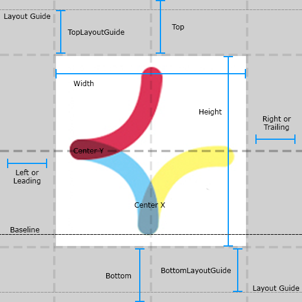
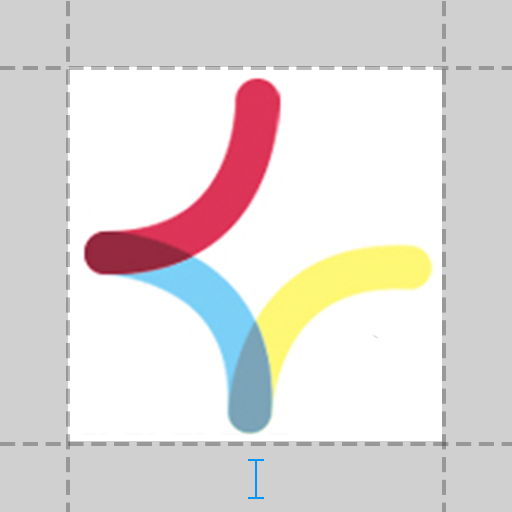
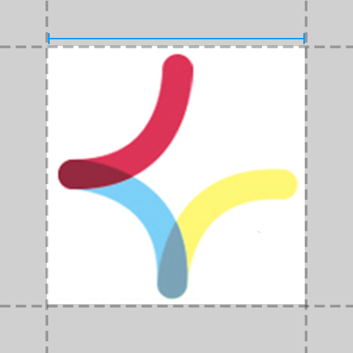

# KVConstraintKit
[](https://travis-ci.org/keshavvishwkarma/KVConstraintKit)
[](http://cocoapods.org/pods/KVConstraintKit)
[](http://cocoapods.org/pods/KVConstraintKit)
[](http://cocoapods.org/pods/KVConstraintKit)

KVConstraintKit is a DSL to make easy & impressive Auto Layout constraints on iOS, tvOS & OSX with Swift


## Installation

KVConstraintKit is available through [CocoaPods](http://cocoapods.org). To install
it, simply add the following line to your Podfile:

```ruby
pod 'KVConstraintKit'
```
## Auto Layout Attributes
`KVConstraintKit` supports all built-in layout attributes as of iOS, tvOS & OSX, see the [NSLayoutAttribute](https://developer.apple.com/reference/uikit/nslayoutattribute) enum.
<p align="center">  </p>

## Usage

Here's a quick example:
##### Without Using KVConstraintKit
```swift
let v = UIView.prepareAutoLayoutView()
v.backgroundColor = UIColor.red
view.addSubview(v)

// Prepare constraints and then add them on superview of view
let top = NSLayoutConstraint( item: v, attribute: .top,
                         relatedBy: .equal,
                            toItem: v.superview!, attribute: .top,
                        multiplier: 1.0, constant: 0)

let leading = NSLayoutConstraint( item: v, attribute: .leading,
                             relatedBy: .equal,
                                toItem: v.superview!, attribute: .leading,
                            multiplier: 1.0, constant: 0)

let trailing = NSLayoutConstraint( item: v, attribute: .trailing,
                              relatedBy: .equal,
                                 toItem: v.superview!, attribute: .trailing,
                             multiplier: 1.0, constant: 0)

let bottom = NSLayoutConstraint( item: v, attribute: .bottom,
                            relatedBy: .equal,
                               toItem: v.superview!, attribute: .bottom,
                           multiplier: 1.0, constant: 0)

v.superview?.addConstraints([top, leading, trailing, bottom])
```

##### Using KVConstraintKit
```swift
v +== [.top, .leading, .trailing, .bottom]
```
##### Similarly for margin constraints
```swift
v +== [ .leadingMargin, .trailingMargin, .topMargin, .bottomMargin]
```

### Fit
Horizontally

```swift
view.applyConstraintFitHorizontallyToSuperview()
OR
view.applyConstraintFitHorizontallyToSuperview(20) // padding
```
Vertically

```swift
view.applyConstraintFitVerticallyToSuperview()
OR
view.applyConstraintFitVerticallyToSuperview(20) // padding
```
Horizontally & Vertically

```swift
view.applyConstraintFitToSuperview()
OR
view.applyConstraintFitToSuperview(20) // width same padding for all edge
```

Fit with inset

```swift
let inset = UIEdgeInsets(top: 4, left: 8, bottom: 12, right: 16)    
view.applyConstraintFitToSuperview(contentInset:inset)
```
### Size

Width

```swift
view.applyWidthConstraint(100)
OR
view.applyAtLeastWidthConstraint(100)
OR
view.applyAtMostWidthConstraint(100)
```

Height

```swift
view.applyHeightConstraint(100)
OR
view.applyAtLeastHeightConstraint(100)
OR
view.applyAtMostHeightConstraint(100)
```

Aspact Ratio

```swift
view.applyAspectRatioConstraint()
```

#### Quick Reference

<table style="width:100%">
<tr style="text-align: center"> 
<!--    <th width="20%" > Layout Attributes width Sketch </th> --> 
<th width="20%" align=center valign=middle> Layout Attributes </th>
<th width="40%" align=center valign=middle> Using Operator    </th>
<th width="40%" align=center valign=middle> Using Method      </th>
</tr>

<tr style="text-align: center">
<td width="20%" align=center valign=middle> <code>Leading</code>  </td>
<td width="40%" align=center valign=middle> <code>(subview +== .leading).constant = 20</code> </td>
<td width="40%" align=center valign=middle> <code>subview.applyLeadingPinConstraintToSuperview(20)</code> </td>
</tr>

<tr style="text-align: center">
<td width="20%" align=center valign=middle> <code>Trailing</code>  </td>
<td width="40%" align=center valign=middle> <code>(subview +== .trailing).constant = 20</code> </td>
<td width="40%" align=center valign=middle> <code>subview.applyTrailingPinConstraintToSuperview(20)</code> </td>
</tr>

<tr style="text-align: center">
<td width="20%" align=center valign=middle> <code>Top</code>  </td>
<td width="40%" align=center valign=middle> <code>(subview +== .top).constant = 20</code> </td>
<td width="40%" align=center valign=middle> <code>subview.applyTopPinConstraintToSuperview(20) </code> </td>
</tr>

<tr style="text-align: center">
<td width="20%" align=center valign=middle> <code>Bottom</code>  </td>
<td width="40%" align=center valign=middle> <code>(subview +== .bottom).constant = 20</code> </td>
<td width="40%" align=center valign=middle> <code>subview.applyBottomPinConstraintToSuperview(20)</code> </td>
</tr>

<tr style="text-align: center">
<td width="20%" align=center valign=middle> <code>CenterX</code>  </td>
<td width="40%" align=center valign=middle> <code>subview +== .centerX</code> </td>
<td width="40%" align=center valign=middle> <code>subview.applyCenterXPinConstraintToSuperview()</code> </td>
</tr>

<tr style="text-align: center">
<td width="20%" align=center valign=middle> <code>CenterY</code>  </td>
<td width="40%" align=center valign=middle> <code>subview +== .centerY</code> </td>
<td width="40%" align=center valign=middle> <code>subview.applyCenterYPinConstraintToSuperview()</code> </td>
</tr>

<tr style="text-align: center">
<td width="20%" align=center valign=middle> <code>Height</code>  </td>
<td width="40%" align=center valign=middle> <code>subview +== (.height, 100)</code> </td>
<td width="40%" align=center valign=middle> <code>subview.applyHeightConstraint(100)</code> </td>
</tr>

<tr style="text-align: center">
<td width="20%" align=center valign=middle> <code>Width</code>  </td>
<td width="40%" align=center valign=middle> <code>subview +== (.width, 100)</code> </td>
<td width="40%" align=center valign=middle> <code>subview.applyWidthConstraint(100)</code> </td>
</tr>

<tr style="text-align: center">
<td width="20%" align=center valign=middle> <code>CenterX & CenterY</code>  </td>
<td width="40%" align=center valign=middle> <code>subview +== [.centerX, .centerY]</code> </td>
<td width="40%" align=center valign=middle> <code>subview.applyConstraintToCenterInSuperview()</code> </td>
</tr>

</table>

For more details see the [ApplyViewConstraint](./KVConstraintKit/ApplyViewConstraint.swift) extension and [LayoutRelationable Protocol](./KVConstraintKit/KVConstraintKitProtocol.swift) of `KVConstraintKit`.

**Note:** Avoid using **Left** and **Right** attributes. Use **Leading** and **Trailing** instead. This allows the layout to adapt to the view’s reading direction. By default the reading direction is determined based on the current language set by the user.

## Custom Operators
The following types of `operators` are provided by `KVConstraintKit`, to `add`, `remove`, `access` and `modify` constraints.

| Operator | Meaning |
| :--------: |-------|
|   +   | to `add` constraint |
|   -   | to `remove` constraint |
|   *   | to modify `multiplier` of constraint |
|   ~   | to modify `Priority` ( **UILayoutPriority** ), `Relation` ( **NSLayoutRelation** ) & `Replace` constraint|
|  <-   | to access constraint by attributes ( **eg. NSLayoutAttribute.Height** ) |
|  +==  | to add equal relation ( **NSLayoutRelation.Equal** ) constraint |
|  +>=  | to add greater than or equal relation ( **NSLayoutRelation.GreaterThanOrEqual** ) constraint |
|  +<=  | to add less than or equal relation ( **NSLayoutRelation.LessThanOrEqual** ) constraint |
|  *==  | to add equal relation constraint with `multiplier` |
|  *>=  | to add greater than or equal relation constraint with `multiplier` |
|  *<=  | to add less than or equal relation constraint with `multiplier` |
| &#124;==&#124; | to add or equal relation constraint between sibling views |
| &#124;<=&#124; | to add greater than or equal relation constraint between sibling views |
| &#124;<=&#124; | to add less than or equal relation constraint between sibling views |

## License

`KVConstraintKit` is available under the MIT license. See the LICENSE file for more info.

## Contributions

Any contribution is more than welcome! You can contribute through pull requests and issues on GitHub.

## Author

If you wish to contact me, email at: keshavvbe@gmail.com
